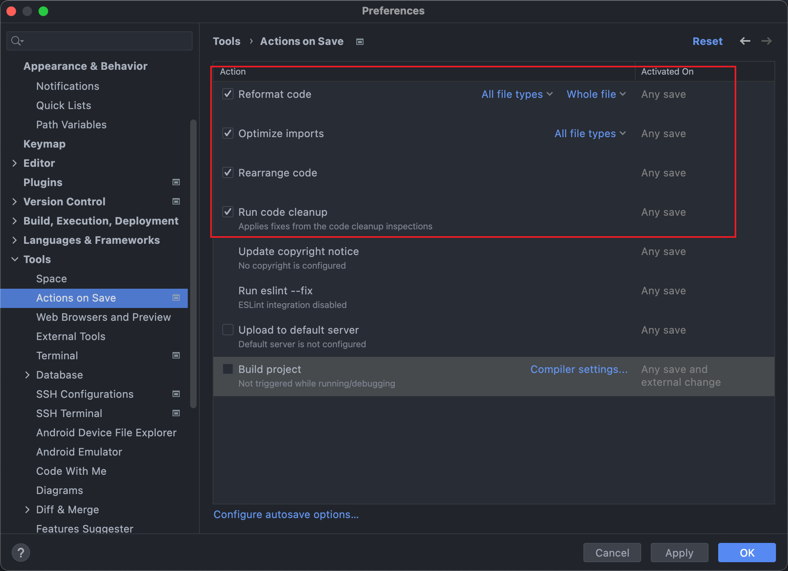
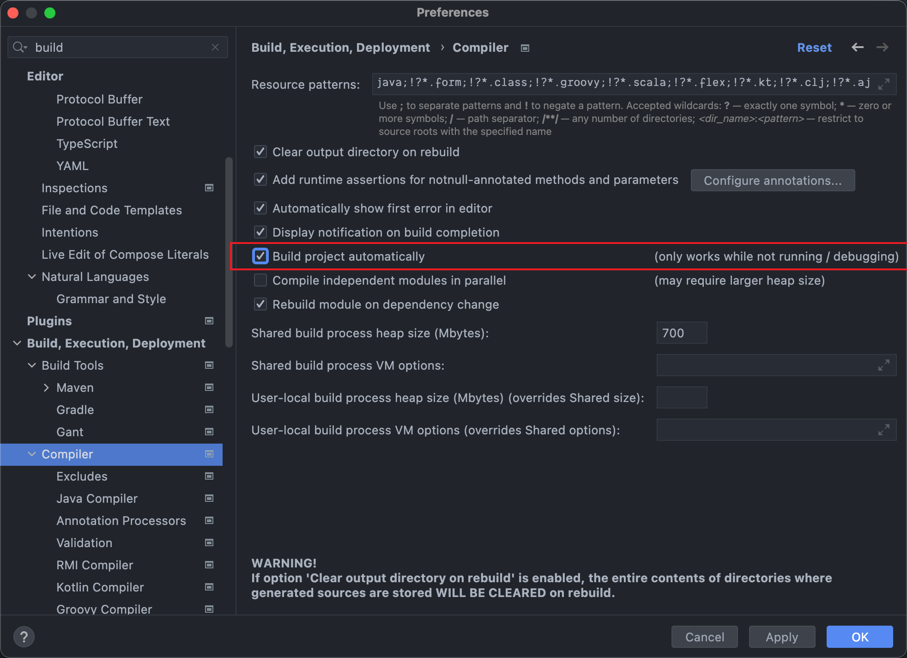
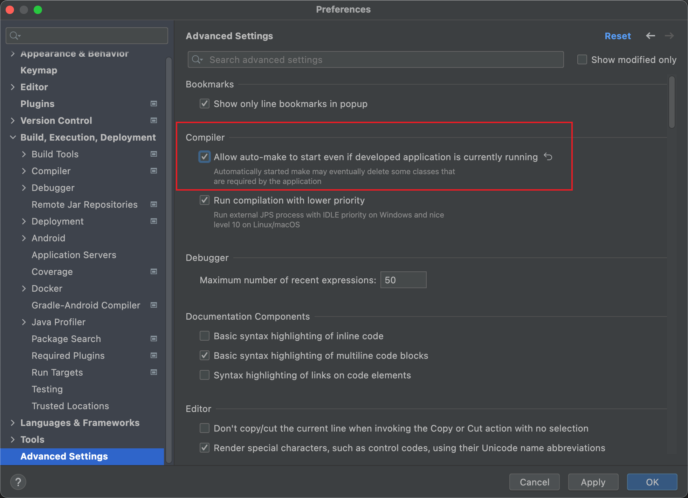

# Full stack spring boot 2.6.7 + React 18

Learn from https://github.com/PacktPublishing/Full-Stack-Development-with-Spring-Boot-and-React

Initial packages:

`spring-boot-devtools` helps to restart the server for classpath changes.

```
dependencies {
    implementation 'org.springframework.boot:spring-boot-starter-data-jpa'
    implementation 'org.springframework.boot:spring-boot-starter-web'
    compileOnly 'org.projectlombok:lombok'
    developmentOnly 'org.springframework.boot:spring-boot-devtools'
    runtimeOnly 'com.h2database:h2'
    runtimeOnly 'org.postgresql:postgresql'
    annotationProcessor 'org.projectlombok:lombok'
    testImplementation 'org.springframework.boot:spring-boot-starter-test'
}
```

## IDE Configurations







## Assumptions

- Car to Owner: N to 1
- Student to Course: N to N

## TODO

- [] how to save N:N mapping table, e.g. course_student?